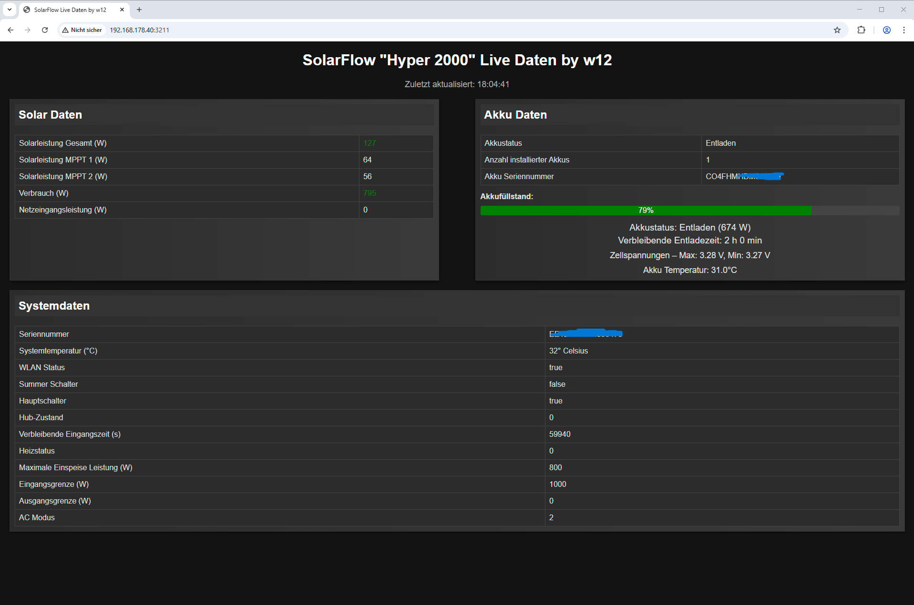

# Hyper-2000 Web Ansicht für Linux (z.b. Raspberry)

# 1. Das Installations Script ausführen.

git clone https://github.com/worgon12/Hyper-2000.git

cd Hyper-2000

chmod +x install.sh

sudo ./install.sh oder mit bash install.sh

Im Installations Script ist auch die Curl Abfrage für die API eingebaut um den Zugang zu MQTT von Zendure zu erhalten.

Das Script erstellt eine login.txt mit deinen appkey und secret für MQTT

Nach Abschluss wir automatisch gestartet 

Info vom Installations Script beachten..

# 2. Wenn Manuell ohne Install Script

die manuelle Curl Abfrage ist..

Windows:
curl -H "Content-Type: application/json" -X POST -d "{\"snNumber\":\"EureHubSeriennummer\",\"account\":\"EureEmailadresse\"}" https://app.zendure.tech/eu/developer/api/apply

Linux:
curl -i -v --json "{'snNumber': 'EureHubSeriennummer', 'account': 'EureEmailadresse'}" https://app.zendure.tech/eu/developer/api/apply

eine login.txt erstellen und dein appKey (1.Zeile) und secret (2.Zeile) eintragen

Speichern 

app.py mit python3 app.py starten 

Die Oberfläche ist unter der Device IP erreichbar -> http://IP:3211 

